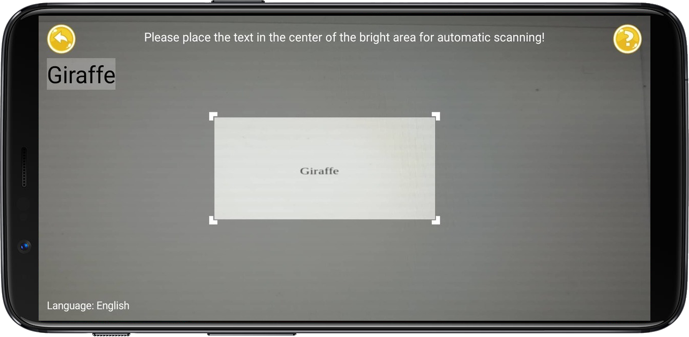
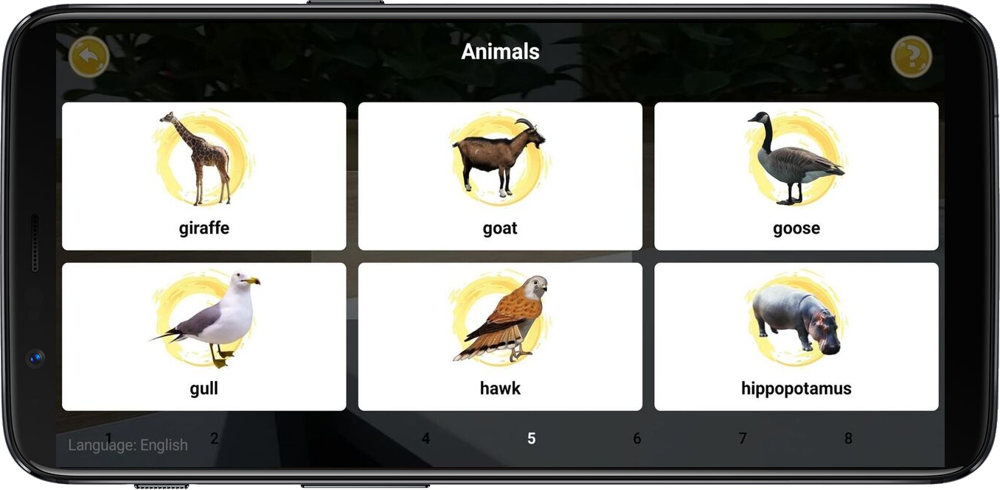
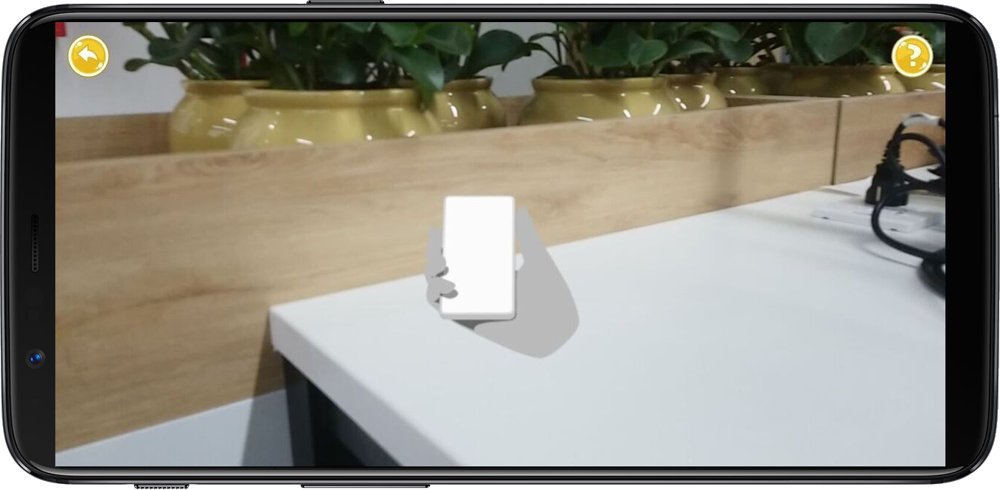
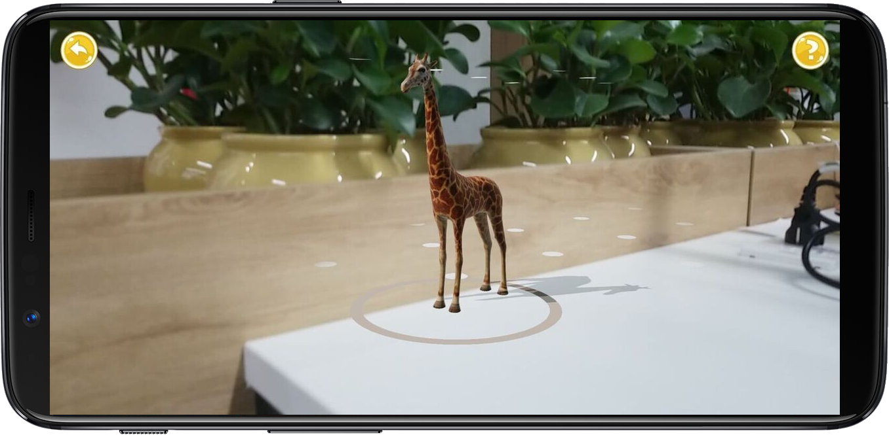

## Giới thiệu

Ứng dụng ra ứng dụng AR Animal kết hợp việc nhận dạng tên con vật và công nghệ thực tế ảo AR. Bằng cách sử dụng 1 điện thoại hoặc 1 máy tính bảng để  quét tên con vật, chọn mặt phẳng để đặt chúng trên màn hình và sau đó con vật sẽ xuất  hiện một cách sinh động. Không chỉ được quan sát muông thú một cách gần gũi như ở ngoài thực tế mà còn cung cấp đủ mọi thông tin về loài vật ấy nữa. Bọn trẻ cũng có thể
xoay vòng, phóng to hay thu nhỏ kích cỡ của những "người bạn thú ảo" theo ý thích.

## Hình ảnh
### Nhận dạng tên động vật

   

   	 
   

   
### Biểu diễn mô hình AR

   

	 
   

## Yêu cầu thiết bị

- Android:

   + Min sdk: 26

   + Target sdk: 28

- ARCore: các thiết bị được hỗ trợ AR, xem chi tiết - https://developers.google.com/ar/discover/supported-devices

## Thư viện và công nghệ

- Platform: Android - https://www.android.com/

- Language: Java

- Library:

   + Tesseract - https://github.com/tesseract-ocr/tesseract

   + OpenCV - https://opencv.org/

- SDK: ARCore - https://developers.google.com/ar

## Tác giả

Lê Trọng Tín - 15520893@gm.uit.edu.vn

Bùi Phạm Minh Thi - 15520824@gm.uit.edu.vn

## Giấy phép

    Copyright 2014

    Licensed under the Apache License, Version 2.0 (the "License");
    you may not use this file except in compliance with the License.
    You may obtain a copy of the License at

       http://www.apache.org/licenses/LICENSE-2.0

    Unless required by applicable law or agreed to in writing, software
    distributed under the License is distributed on an "AS IS" BASIS,
    WITHOUT WARRANTIES OR CONDITIONS OF ANY KIND, either express or implied.
    See the License for the specific language governing permissions and
    limitations under the License.
